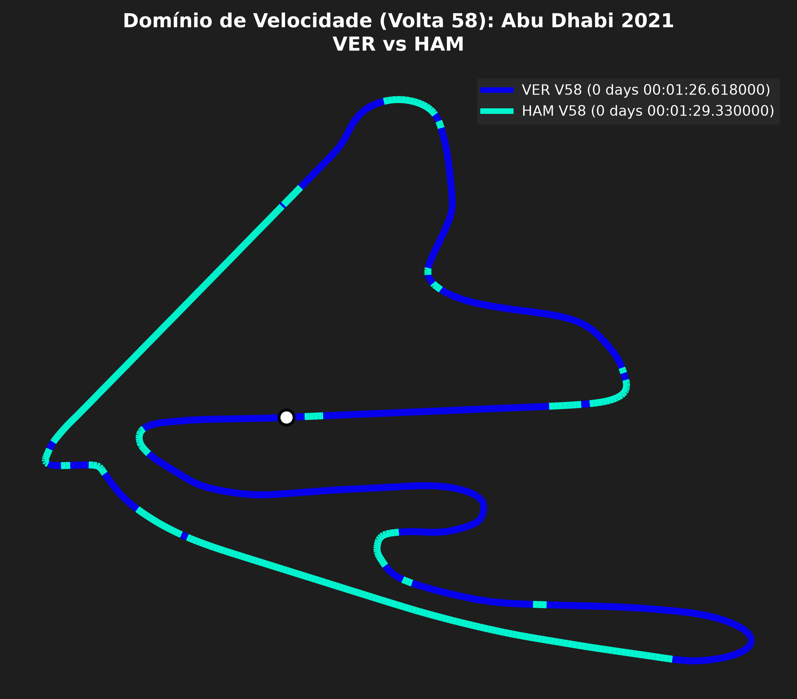
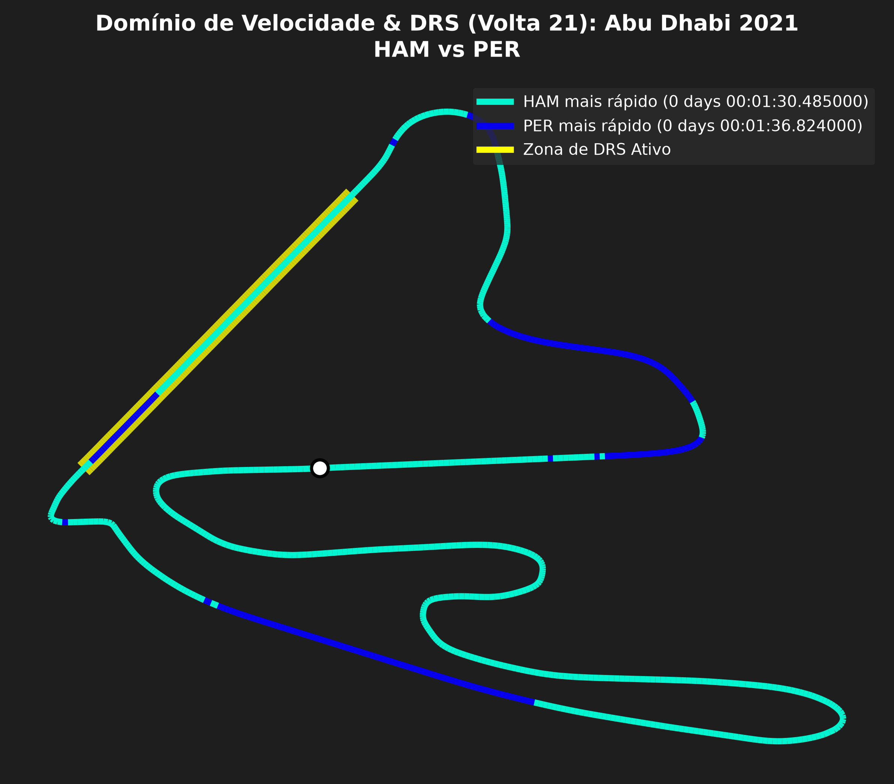
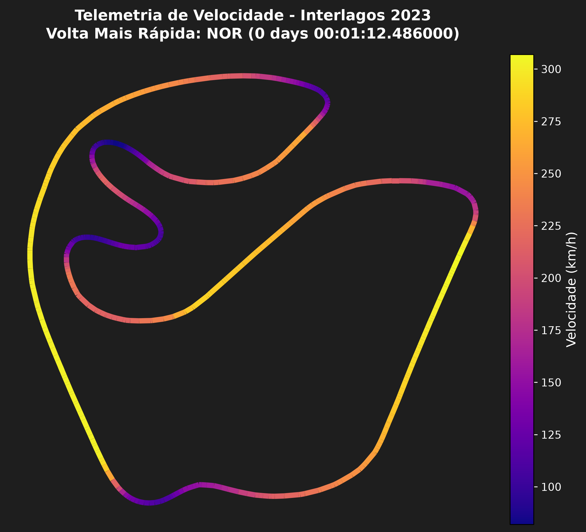
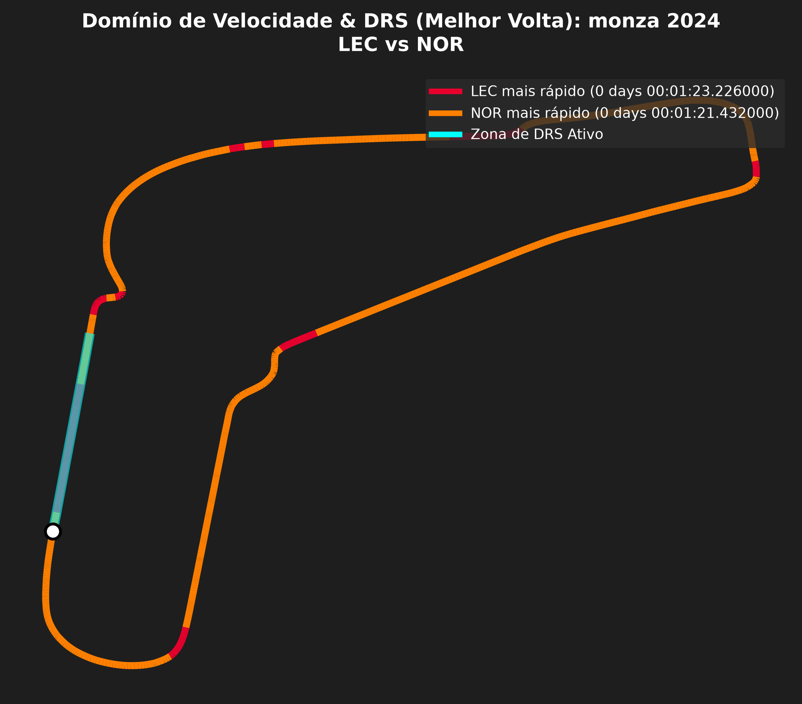

# 🏎️ F1 Data Tracker

Projeto desenvolvido para consultar, organizar e analisar estatísticas históricas de pilotos na **Fórmula 1**, com foco no desempenho de pilotos brasileiros.

Este repositório contém duas implementações independentes para demonstrar diferentes abordagens de desenvolvimento:

1. **Versão em C:** foca no aprendizado de baixo nível, manipulação de arquivos CSV, structs e algoritmos de ordenação (*Bubble Sort*).
2. **Versão em Python:** foca na estruturação de dados em formato JSON, manipulação de coleções dinâmicas e facilidade de manutenção.

---

## 🛠️ Tecnologias Utilizadas

- **Linguagem C** (`stdio.h`, `stdlib.h`, `string.h`)
- **Python 3** (módulo nativo `json`)
- **Estruturas de Dados:** Structs, Arrays, Dicionários e Listas
- **Formatos de Dados:** CSV e JSON

---
### 📊 Resultados e Gráficos de Telemetria (Versão Python)

| Comparação de Telemetria (Abu Dhabi 2021) | Análise de Zonas de DRS |
| :---: | :---: |
|  |  |

| Telemetria Interlagos | Comparação Monza 2024 |
| :---: | :---: |
|  |  |

## 🚀 Como Executar os Projetos

### 1. Versão em C
Navegue até a pasta `c-version`, compile e execute:
```bash
cd c-version
gcc main.c -o f1_c
./f1_c
```
### 2. Versão em Python

A versão em Python realiza a consulta de dados, estruturação em JSON e geração de gráficos de telemetria das corridas.

#### 📋 Pré-requisitos
Certifique-se de ter o Python 3.10+ instalado em sua máquina. Para gerar os gráficos e análises de telemetria, instale as dependências necessárias executando:

```bash
pip install fastf1 matplotlib pandas numpy
```
Navegue até a pasta python-version:
```bash
cd python-version
```
Executar rastreamento e dados gerais:
```bash
python f1_tracker.py
```
Executar comparação de telemetria:
```bash
python comparacao_telemetria.py
```

